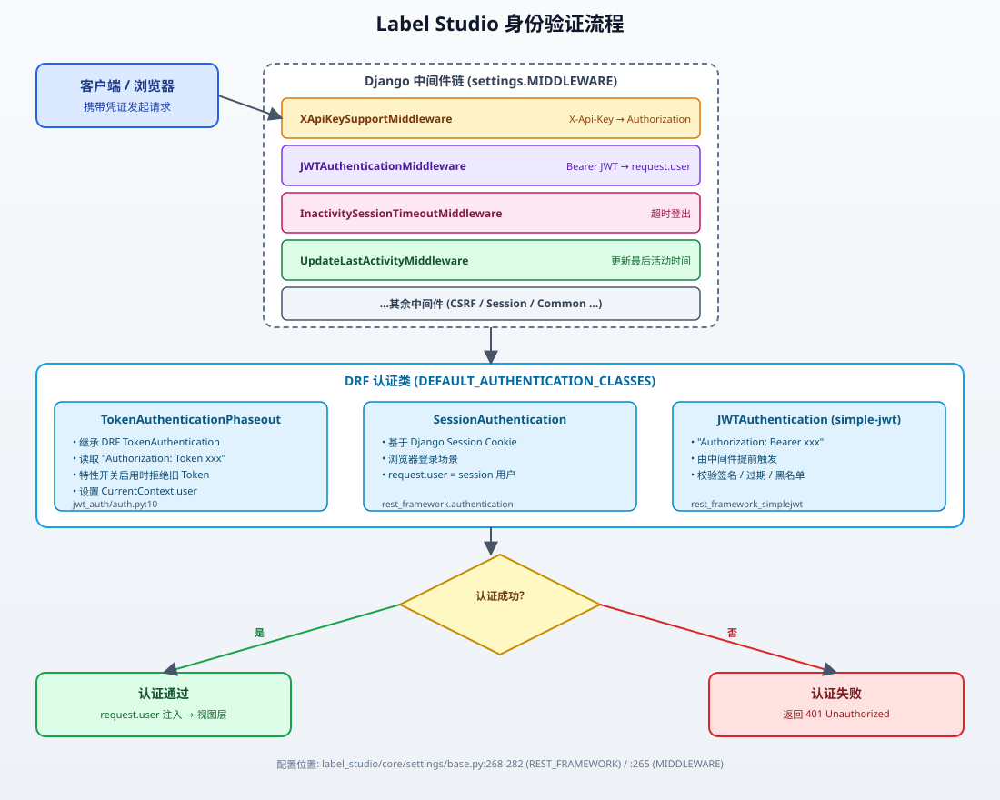
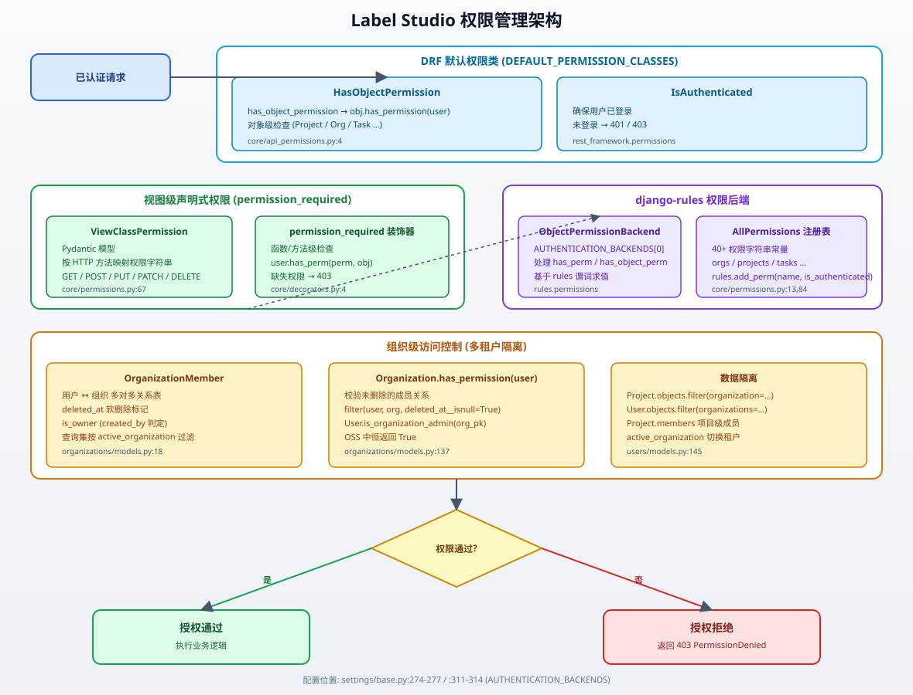
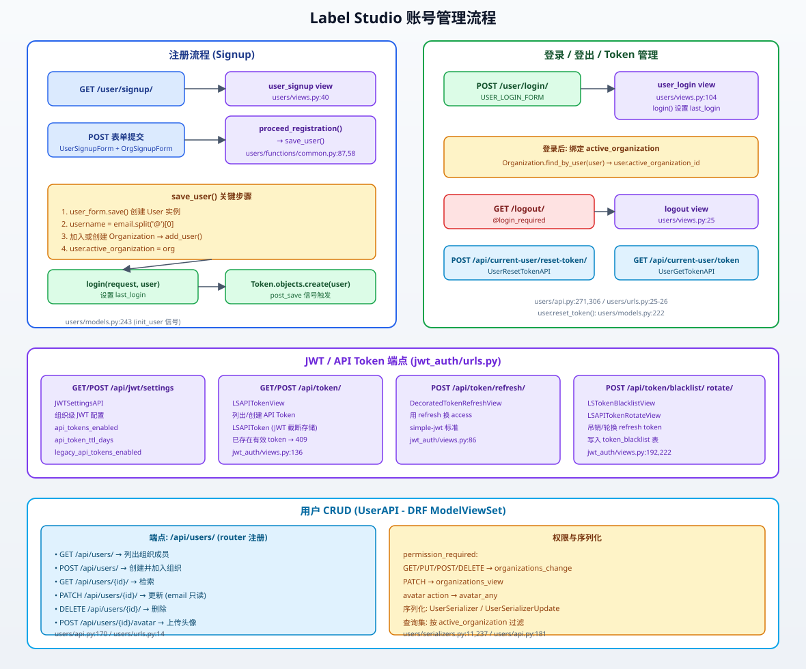
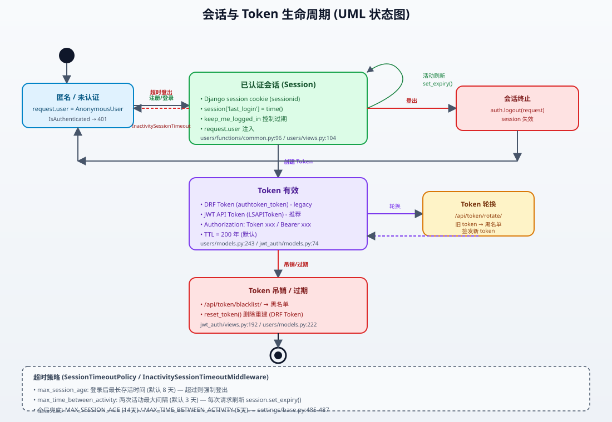
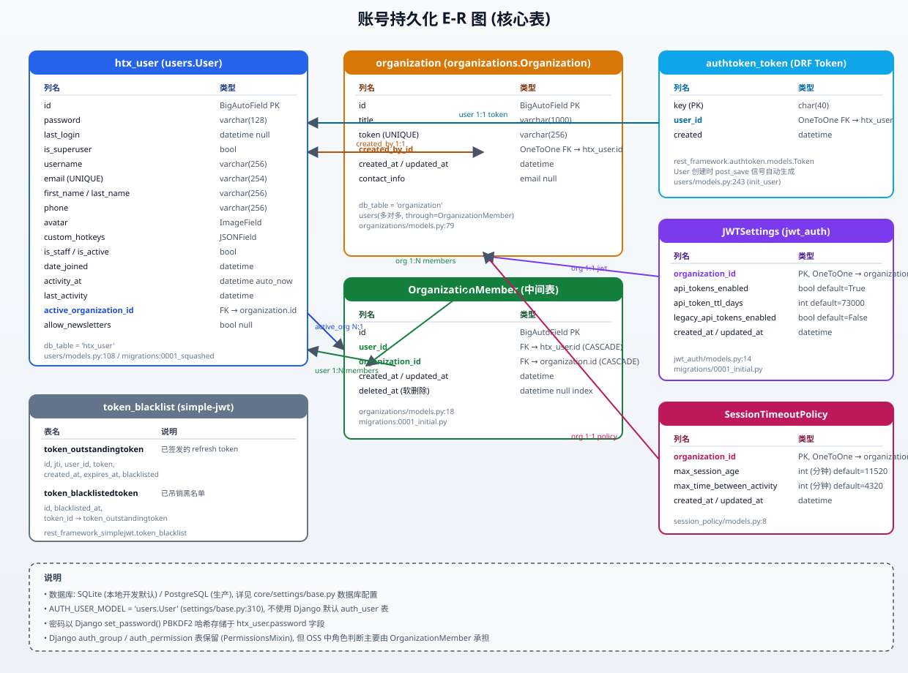

# Label Studio 身份认证与授权分析

> 本文档基于 `label_studio` 后端源码梳理身份验证（Authentication）、权限管理（Authorization）、账号管理（Account Management）以及账号信息持久化方案的具体实现位置，并配以 SVG 框图、UML 图与 E-R 图。

---

## 目录

1. [身份验证实现](#1-身份验证实现)
2. [权限管理实现](#2-权限管理实现)
3. [账号与账号信息管理](#3-账号与账号信息管理)
4. [账号信息持久化方案与表结构](#4-账号信息持久化方案与表结构)
5. [安全机制补充](#5-安全机制补充)

---

## 1. 身份验证实现

Label Studio 的身份验证采用「会话认证 + Token 认证 + JWT 认证」三层并存机制，由 DRF（Django REST Framework）统一编排，并通过 Django 中间件链在请求早期完成用户注入。



### 1.1 DRF 认证类配置

配置位置：[label_studio/core/settings/base.py#L268-L282](file:///c:/Users/yystj/work/label-studio/label-studio/label_studio/core/settings/base.py#L268-L282)

```python
REST_FRAMEWORK = {
    'DEFAULT_AUTHENTICATION_CLASSES': (
        'jwt_auth.auth.TokenAuthenticationPhaseout',      # ① Token 认证（带旧 Token 淘汰逻辑）
        'rest_framework.authentication.SessionAuthentication',  # ② 会话认证
    ),
    'DEFAULT_PERMISSION_CLASSES': [
        'core.api_permissions.HasObjectPermission',
        'rest_framework.permissions.IsAuthenticated',
    ],
    ...
}
```

> 说明：DRF 会按顺序依次尝试每个认证类，第一个成功返回 `(user, token)` 的类即为该请求的认证结果。JWT（Bearer）认证由中间件提前处理（见 1.3），因此这里不直接注册 `JWTAuthentication`，仅在 `LSAPITokenRotateView` 等特定视图显式声明。

### 1.2 Token 认证（Legacy + 淘汰逻辑）

| 文件 | 关键类/函数 | 行号 | 说明 |
| --- | --- | --- | --- |
| [label_studio/jwt_auth/auth.py](file:///c:/Users/yystj/work/label-studio/label-studio/label_studio/jwt_auth/auth.py) | `TokenAuthenticationPhaseout` | L10-L43 | 继承 DRF `TokenAuthentication`，读取 `Authorization: Token <key>` |
| [label_studio/jwt_auth/auth.py](file:///c:/Users/yystj/work/label-studio/label-studio/label_studio/jwt_auth/auth.py) | `JWTAuthScheme` | L46-L65 | drf-spectacular OpenAPI 认证扩展，声明 `apiKey` 类型 |
| [label_studio/users/models.py](file:///c:/Users/yystj/work/label-studio/label-studio/label_studio/users/models.py) | `init_user` 信号 | L243-L247 | User 创建后通过 `post_save` 信号自动生成 DRF `Token` |
| [label_studio/users/models.py](file:///c:/Users/yystj/work/label-studio/label-studio/label_studio/users/models.py) | `User.get_token / reset_token` | L219-L224 | 获取 / 重置 Token |

工作流程：
1. `super().authenticate(request)` 使用 `rest_framework.authtoken.models.Token` 完成基础校验；
2. 成功后调用 `CurrentContext.set_user(user)` 注入线程上下文；
3. 当特性开关 `fflag__feature_develop__prompts__dia_1829_jwt_token_auth` 启用且组织的 `JWTSettings.legacy_api_tokens_enabled` 为 `False` 时，直接抛出 `AuthenticationFailed`（即「旧 Token 淘汰」）。

### 1.3 JWT 认证（Bearer）

JWT 通过独立中间件提前解析，而非依赖 DRF 默认认证链：

| 文件 | 关键类/函数 | 行号 | 说明 |
| --- | --- | --- | --- |
| [label_studio/jwt_auth/middleware.py](file:///c:/Users/yystj/work/label-studio/label-studio/label_studio/jwt_auth/middleware.py) | `JWTAuthenticationMiddleware` | L12-L48 | 检测 `Authorization: Bearer xxx.xxx.xxx` 并调用 `JWTAuthentication().authenticate()` |
| [label_studio/jwt_auth/models.py](file:///c:/Users/yystj/work/label-studio/label-studio/label_studio/jwt_auth/models.py) | `LSTokenBackend` | L41-L71 | 自定义 Token 后端，存储时截断签名段（仅保留 header.payload） |
| [label_studio/jwt_auth/models.py](file:///c:/Users/yystj/work/label-studio/label-studio/label_studio/jwt_auth/models.py) | `LSAPIToken` | L74-L111 | 继承 simple-jwt `RefreshToken`，TTL 默认 200 年 |
| [label_studio/jwt_auth/models.py](file:///c:/Users/yystj/work/label-studio/label-studio/label_studio/jwt_auth/models.py) | `TruncatedLSAPIToken` | L114-L129 | 处理截断后的 token（补 43 位 `x` 占位签名） |
| [label_studio/jwt_auth/views.py](file:///c:/Users/yystj/work/label-studio/label-studio/label_studio/jwt_auth/views.py) | `LSAPITokenView / LSTokenBlacklistView / LSAPITokenRotateView / DecoratedTokenRefreshView` | L62-L262 | JWT 创建 / 列表 / 黑名单 / 轮换 / 刷新视图 |

中间件在 [base.py:265](file:///c:/Users/yystj/work/label-studio/label-studio/label_studio/core/settings/base.py#L265) 注册：

```python
'jwt_auth.middleware.JWTAuthenticationMiddleware',
```

JWT 启用条件：特性开关 `fflag__feature_develop__prompts__dia_1829_jwt_token_auth` 为 `True` 且 `user.active_organization.jwt.api_tokens_enabled` 为 `True`。

### 1.4 会话认证

- 基于 Django `SessionAuthentication`，依赖 `sessionid` Cookie；
- 登录入口 [label_studio/users/views.py `user_login`](file:///c:/Users/yystj/work/label-studio/label-studio/label_studio/users/views.py#L103-L141)，登录成功后调用 [users/functions/common.py `login()`](file:///c:/Users/yystj/work/label-studio/label-studio/label_studio/users/functions/common.py#L96-L98) 写入 `session['last_login']`；
- 会话超时由 [`InactivitySessionTimeoutMiddleware`](file:///c:/Users/yystj/work/label-studio/label-studio/label_studio/core/middleware.py#L193-L247) 控制。

### 1.5 X-Api-Key 头支持

[label_studio/core/middleware.py `XApiKeySupportMiddleware`](file:///c:/Users/yystj/work/label-studio/label-studio/label_studio/core/middleware.py#L171-L184) 将 `X-Api-Key` 头改写为 `Authorization: Token <key>`，便于 SDK / 命令行使用。

### 1.6 认证后端配置

[label_studio/core/settings/base.py:311-314](file:///c:/Users/yystj/work/label-studio/label-studio/label_studio/core/settings/base.py#L311-L314)：

```python
AUTH_USER_MODEL = 'users.User'
AUTHENTICATION_BACKENDS = [
    'rules.permissions.ObjectPermissionBackend',  # 优先：基于 rules 的对象级权限
    'django.contrib.auth.backends.ModelBackend',   # 兜底：用户名/密码 + is_active
]
USE_USERNAME_FOR_LOGIN = False  # 使用邮箱登录
```

---

## 2. 权限管理实现

Label Studio 权限体系基于 **django-rules** 谓词系统 + DRF 权限类 + 组织级多租户隔离三层结构。



### 2.1 权限定义中心：AllPermissions

文件：[label_studio/core/permissions.py](file:///c:/Users/yystj/work/label-studio/label-studio/label_studio/core/permissions.py)

| 内容 | 行号 | 说明 |
| --- | --- | --- |
| `AllPermissions` Pydantic 模型 | L13-L63 | 集中声明 40+ 权限字符串常量（`organizations.view`、`projects.create`、`tasks.change`、`annotations.delete` 等） |
| `all_permissions` 单例 | L64 | 全局可引用的权限常量实例 |
| `ViewClassPermission` | L67-L72 | 按 HTTP 方法（GET/POST/PUT/PATCH/DELETE）映射权限字符串 |
| `make_perm()` 注册逻辑 | L75-L81 | 调用 `rules.add_perm(name, rules.is_authenticated)` 将所有权限注册到 rules |
| 批量注册循环 | L84-L85 | 启动时遍历 `all_permissions` 完成注册 |

> 在 OSS 社区版中，所有权限的默认谓词均为 `rules.is_authenticated`（即「登录即拥有」），细化到角色/对象的权限在 Enterprise 版扩展。

### 2.2 DRF 默认权限类

文件：[label_studio/core/api_permissions.py](file:///c:/Users/yystj/work/label-studio/label-studio/label_studio/core/api_permissions.py)

| 类 | 行号 | 作用 |
| --- | --- | --- |
| `HasObjectPermission` | L4-L6 | 对象级权限：调用 `obj.has_permission(request.user)` |
| `MemberHasOwnerPermission` | L9-L13 | 非安全方法需校验当前用户为组织拥有者 |

二者在 [base.py:274-277](file:///c:/Users/yystj/work/label-studio/label-studio/label_studio/core/settings/base.py#L274-L277) 设为 `DEFAULT_PERMISSION_CLASSES`（叠加 `IsAuthenticated`）。

### 2.3 视图级声明式权限

各业务视图通过类属性 `permission_required = ViewClassPermission(...)` 声明每个 HTTP 方法所需的权限字符串。典型用法见：

| 视图 | 文件 / 行号 | 声明示例 |
| --- | --- | --- |
| `ProjectListAPI` | [projects/api.py:168](file:///c:/Users/yystj/work/label-studio/label-studio/label_studio/projects/api.py#L168) | `GET=projects_view, POST=projects_create` |
| `OrganizationListAPI` | [organizations/api.py:62](file:///c:/Users/yystj/work/label-studio/label-studio/label_studio/organizations/api.py#L62) | 全方法 organizations_* |
| `TaskListAPI` 等多个 | [tasks/api.py:180,280,458,637,756,862,885](file:///c:/Users/yystj/work/label-studio/label-studio/label_studio/tasks/api.py#L180) | tasks_view / tasks_change |
| `WebhookListAPI` | [webhooks/api.py:64](file:///c:/Users/yystj/work/label-studio/label-studio/label_studio/webhooks/api.py#L64) | webhooks_view / webhooks_change |
| `MLBackendListAPI` | [ml/api.py:116](file:///c:/Users/yystj/work/label-studio/label-studio/label_studio/ml/api.py#L116) | projects_change |
| `UserAPI` | [users/api.py:172](file:///c:/Users/yystj/work/label-studio/label-studio/label_studio/users/api.py#L172) | organizations_change / organizations_view |
| `JWTSettingsAPI` | [jwt_auth/views.py:64](file:///c:/Users/yystj/work/label-studio/label-studio/label_studio/jwt_auth/views.py#L64) | organizations_view / organizations_change |

方法/函数级权限则使用 [core/decorators.py `permission_required`](file:///c:/Users/yystj/work/label-studio/label-studio/label_studio/core/decorators.py#L4-L23) 装饰器，内部调用 `request.user.has_perm(perm, obj)`（最终走 `rules.permissions.ObjectPermissionBackend` 求值），缺失权限触发 DRF `permission_denied` 返回 403。

### 2.4 组织级访问控制（多租户）

| 文件 / 类 | 行号 | 作用 |
| --- | --- | --- |
| [organizations/models.py `Organization.has_permission`](file:///c:/Users/yystj/work/label-studio/label-studio/label_studio/organizations/models.py#L137-L138) | L137-L138 | 校验 `OrganizationMember` 存在且未软删除 |
| [organizations/models.py `OrganizationMember`](file:///c:/Users/yystj/work/label-studio/label-studio/label_studio/organizations/models.py#L18-L72) | L18-L72 | 中间表，`deleted_at` 软删除，`is_owner` 由 `created_by` 判定 |
| [users/models.py `User.is_organization_admin`](file:///c:/Users/yystj/work/label-studio/label-studio/label_studio/users/models.py#L179-L180) | L179-L180 | OSS 中恒返回 `True`（角色细化由 Enterprise 扩展） |
| [users/api.py `UserAPI.get_queryset`](file:///c:/Users/yystj/work/label-studio/label-studio/label_studio/users/api.py#L181-L182) | L181-L182 | 按 `active_organization` 过滤用户，保证租户隔离 |

数据隔离模式：所有业务模型（`Project`、`Task` 等）的查询集都通过 `organization=self.request.user.active_organization` 进行过滤，对象级 `has_permission(user)` 方法（如 `Project.has_permission`）进一步限定访问。

### 2.5 权限查询接口

[label_studio/users/serializers.py `BaseWhoAmIUserSerializer.get_permissions`](file:///c:/Users/yystj/work/label-studio/label-studio/label_studio/users/serializers.py#L104-L111) 通过 `WhoAmIUserSerializer`（`/api/current-user/whoami`）向前端返回当前用户全部权限字符串列表，供前端做按钮/菜单可见性判断。

---

## 3. 账号与账号信息管理



### 3.1 注册流程

| 步骤 | 文件 / 函数 | 行号 | 说明 |
| --- | --- | --- | --- |
| 入口视图 | [users/views.py `user_signup`](file:///c:/Users/yystj/work/label-studio/label-studio/label_studio/users/views.py#L39-L100) | L39-L100 | `GET/POST /user/signup/`，CSRF 强制校验 |
| 表单 | `UserSignupForm` + `OrganizationSignupForm` | — | 由 `settings.USER_SIGNUP_FORM` 可替换 |
| 注册编排 | [users/functions/common.py `proceed_registration`](file:///c:/Users/yystj/work/label-studio/label-studio/label_studio/users/functions/common.py#L87-L93) | L87-L93 | 通过 `load_func(settings.SAVE_USER)` 支持扩展 |
| 保存逻辑 | [users/functions/common.py `save_user`](file:///c:/Users/yystj/work/label-studio/label-studio/label_studio/users/functions/common.py#L58-L84) | L58-L84 | 创建 User、加入/创建 Organization、设置 `active_organization`、调用 `login()` |
| Token 自动生成 | [users/models.py `init_user`](file:///c:/Users/yystj/work/label-studio/label-studio/label_studio/users/models.py#L243-L247) | L243-L247 | `post_save` 信号触发 `Token.objects.create(user)` |

注册开关：[base.py:317](file:///c:/Users/yystj/work/label-studio/label-studio/label_studio/core/settings/base.py#L317) `DISABLE_SIGNUP_WITHOUT_LINK`，需匹配组织 `token` 才允许注册。

### 3.2 登录 / 登出

| 端点 | 视图 | 行号 | 说明 |
| --- | --- | --- | --- |
| `GET/POST /user/login/` | [users/views.py `user_login`](file:///c:/Users/yystj/work/label-studio/label-studio/label_studio/users/views.py#L103-L141) | L103-L141 | 表单登录，`persist_session` 控制 `keep_me_logged_in`，登录后绑定 `active_organization` |
| `GET /logout/` | [users/views.py `logout`](file:///c:/Users/yystj/work/label-studio/label-studio/label_studio/users/views.py#L24-L36) | L24-L36 | `@login_required`，调用 `auth.logout`，重定向到 `LOGOUT_REDIRECT_URL` |
| 登录包装函数 | [users/functions/common.py `login`](file:///c:/Users/yystj/work/label-studio/label-studio/label_studio/users/functions/common.py#L96-L98) | L96-L98 | 写入 `session['last_login']` 后调用 Django `auth.login` |

URL 路由：[label_studio/users/urls.py](file:///c:/Users/yystj/work/label-studio/label-studio/label_studio/users/urls.py)（L19-L23）。

### 3.3 账号信息页面与 Token 管理

| 端点 | 视图 / 文件 | 行号 | 说明 |
| --- | --- | --- | --- |
| `GET/POST /user/account/` | [users/views.py `user_account`](file:///c:/Users/yystj/work/label-studio/label-studio/label_studio/users/views.py#L144-L186) | L144-L186 | 展示 + 更新 `UserProfileForm`，显示 API Token |
| `POST /api/current-user/reset-token/` | [users/api.py `UserResetTokenAPI`](file:///c:/Users/yystj/work/label-studio/label-studio/label_studio/users/api.py#L271-L280) | L271-L280 | 删除并重建 DRF Token |
| `GET /api/current-user/token` | [users/api.py `UserGetTokenAPI`](file:///c:/Users/yystj/work/label-studio/label-studio/label_studio/users/api.py#L306-L313) | L306-L313 | 获取当前 DRF Token |
| `GET /api/current-user/whoami` | [users/api.py `UserWhoAmIAPI`](file:///c:/Users/yystj/work/label-studio/label-studio/label_studio/users/api.py#L331-L341) | L331-L341 | 返回用户信息 + 权限列表 |
| `GET/PATCH /api/current-user/hotkeys/` | [users/api.py `UserHotkeysAPI`](file:///c:/Users/yystj/work/label-studio/label-studio/label_studio/users/api.py#L374) | L374 | 自定义快捷键 |

### 3.4 JWT / API Token 端点

URL 路由：[label_studio/jwt_auth/urls.py](file:///c:/Users/yystj/work/label-studio/label-studio/label_studio/jwt_auth/urls.py)

| 端点 | 视图 | 行号 | 用途 |
| --- | --- | --- | --- |
| `GET/POST /api/jwt/settings` | `JWTSettingsAPI` | [jwt_auth/views.py:62](file:///c:/Users/yystj/work/label-studio/label-studio/label_studio/jwt_auth/views.py#L62) | 组织级 JWT 配置（启用/TTL/旧 Token 开关） |
| `GET/POST /api/token/` | `LSAPITokenView` | [jwt_auth/views.py:136](file:///c:/Users/yystj/work/label-studio/label-studio/label_studio/jwt_auth/views.py#L136) | 列出 / 创建 API Token（已存在有效 token 时返回 409） |
| `POST /api/token/refresh/` | `DecoratedTokenRefreshView` | [jwt_auth/views.py:86](file:///c:/Users/yystj/work/label-studio/label-studio/label_studio/jwt_auth/views.py#L86) | 用 refresh 换 access |
| `POST /api/token/blacklist/` | `LSTokenBlacklistView` | [jwt_auth/views.py:192](file:///c:/Users/yystj/work/label-studio/label-studio/label_studio/jwt_auth/views.py#L192) | 吊销 refresh token |
| `POST /api/token/rotate/` | `LSAPITokenRotateView` | [jwt_auth/views.py:222](file:///c:/Users/yystj/work/label-studio/label-studio/label_studio/jwt_auth/views.py#L222) | 轮换（旧 token 黑名单 + 新签发） |

### 3.5 用户 CRUD（UserAPI）

[label_studio/users/api.py `UserAPI`](file:///c:/Users/yystj/work/label-studio/label-studio/label_studio/users/api.py#L170-L245)（`/api/users/`，DRF `ModelViewSet`）：

| 方法 | 端点 | 权限 | 说明 |
| --- | --- | --- | --- |
| GET | `/api/users/` | `organizations_change` | 列出组织成员 |
| POST | `/api/users/` | `organizations_change` | 创建用户并 `add_user` 加入组织 |
| GET | `/api/users/{id}/` | `organizations_change` | 检索 |
| PATCH | `/api/users/{id}/` | `organizations_view` | 更新（`email` 只读） |
| DELETE | `/api/users/{id}/` | `organizations_change` | 删除 |
| POST/DELETE | `/api/users/{id}/avatar` | `avatar_any` | 头像上传 / 删除 |

序列化器：[users/serializers.py](file:///c:/Users/yystj/work/label-studio/label-studio/label_studio/users/serializers.py)
- `BaseUserSerializer`（L11-L96）暴露 id、姓名、邮箱、avatar、initials、active_organization 等；
- `UserSerializerUpdate`（L99-L101）将 `email` 设为只读；
- `WhoAmIUserSerializer`（L104-L111）额外返回 `permissions` 列表。

### 3.6 会话与 Token 生命周期



会话超时配置：[base.py:482-487](file:///c:/Users/yystj/work/label-studio/label-studio/label_studio/core/settings/base.py#L482-L487)

```python
INACTIVITY_SESSION_TIMEOUT_ENABLED = True   # 默认开启
MAX_SESSION_AGE = 14 天                     # 登录后最长存活
MAX_TIME_BETWEEN_ACTIVITY = 5 天            # 两次活动最大间隔
```

组织级覆盖：[session_policy/models.py `SessionTimeoutPolicy`](file:///c:/Users/yystj/work/label-studio/label-studio/label_studio/session_policy/models.py#L8-L30)
- `max_session_age`（默认 8 天）
- `max_time_between_activity`（默认 3 天）

执行中间件：[core/middleware.py `InactivitySessionTimeoutMiddleware`](file:///c:/Users/yystj/work/label-studio/label-studio/label_studio/core/middleware.py#L193-L247) 在每次请求时按组织策略计算 `session.set_expiry()`，超限则 `logout(request)`。JWT 请求（`request.is_jwt`）跳过此中间件。

---

## 4. 账号信息持久化方案与表结构



### 4.1 持久化基础设施

| 项 | 配置位置 | 说明 |
| --- | --- | --- |
| 数据库引擎 | [core/settings/base.py:120-180](file:///c:/Users/yystj/work/label-studio/label-studio/label_studio/core/settings/base.py#L120-L180) | SQLite（本地默认）/ PostgreSQL（生产）/ MySQL 可选 |
| 自定义用户模型 | [base.py:310](file:///c:/Users/yystj/work/label-studio/label-studio/label_studio/core/settings/base.py#L310) | `AUTH_USER_MODEL = 'users.User'`，表名 `htx_user` |
| 密码哈希 | Django 默认 PBKDF2 | `set_password()` 写入 `htx_user.password` |
| 迁移目录 | 各 app `migrations/` | `python label_studio/manage.py migrate` |

### 4.2 核心表结构

#### 4.2.1 `htx_user`（用户主表）

模型：[users/models.py `User`](file:///c:/Users/yystj/work/label-studio/label-studio/label_studio/users/models.py#L108-L169)
迁移：[users/migrations/0001_squashed_0009_auto_20210219_1237.py](file:///c:/Users/yystj/work/label-studio/label-studio/label_studio/users/migrations/0001_squashed_0009_auto_20210219_1237.py)

| 字段 | 类型 | 说明 |
| --- | --- | --- |
| id | BigAutoField PK | 主键 |
| password | varchar(128) | PBKDF2 哈希 |
| last_login | datetime null | 最近登录时间 |
| is_superuser | bool | 超级管理员 |
| username | varchar(256) | 注册时取 email 前缀 |
| email | varchar(254) UNIQUE | 登录凭证（`USERNAME_FIELD`） |
| first_name / last_name | varchar(256) | 姓名 |
| phone | varchar(256) | 电话 |
| avatar | ImageField | 头像（`hash_upload` 命名） |
| custom_hotkeys | JSONField | 自定义快捷键 |
| is_staff / is_active | bool | 后台访问 / 启用状态 |
| date_joined | datetime | 注册时间 |
| activity_at | datetime auto_now | 最近标注活动 |
| last_activity | datetime | 最近任意活动（Redis 缓存，回写库） |
| **active_organization_id** | FK → organization.id | 当前活动组织（多租户切换） |
| allow_newsletters | bool null | 邮件订阅 |

索引：username / email / first_name / last_name / date_joined（`Meta.indexes`）。继承 `PermissionsMixin`，因此 `auth_group`、`auth_permission`、`auth_user_groups`、`auth_user_user_permissions` 表亦存在（OSS 极少使用）。

#### 4.2.2 `organization`（组织表）

模型：[organizations/models.py `Organization`](file:///c:/Users/yystj/work/label-studio/label-studio/label_studio/organizations/models.py#L79-L197)
迁移：[organizations/migrations/0001_initial.py](file:///c:/Users/yystj/work/label-studio/label-studio/label_studio/organizations/migrations/0001_initial.py)

| 字段 | 类型 | 说明 |
| --- | --- | --- |
| id | BigAutoField PK | 主键 |
| title | varchar(1000) | 组织名 |
| token | varchar(256) UNIQUE | 邀请/注册令牌（`create_hash`） |
| **created_by_id** | OneToOne FK → htx_user.id | 创建者（`SET_NULL`） |
| created_at / updated_at | datetime | 时间戳 |
| contact_info | email null | 联系邮箱 |
| users | M2M → htx_user（through=OrganizationMember） | 成员关系 |

#### 4.2.3 `OrganizationMember`（成员中间表）

模型：[organizations/models.py `OrganizationMember`](file:///c:/Users/yystj/work/label-studio/label-studio/label_studio/organizations/models.py#L18-L72)

| 字段 | 类型 | 说明 |
| --- | --- | --- |
| id | BigAutoField PK | 主键 |
| **user_id** | FK → htx_user.id（CASCADE） | 用户 |
| **organization_id** | FK → organization.id（CASCADE） | 组织 |
| created_at / updated_at | datetime | 时间戳 |
| deleted_at | datetime null index | 软删除标记 |

> `OrganizationMember` 早期迁移含 `role` 字段（Administrator/Manager/Coordinator/Collaborator），但 OSS 模型中已移除，`is_owner` 通过 `user.id == organization.created_by.id` 判定。

#### 4.2.4 `authtoken_token`（DRF Token）

来源：`rest_framework.authtoken.models.Token`（第三方 app 自动建表）

| 字段 | 类型 | 说明 |
| --- | --- | --- |
| key | char(40) PK | Token 字符串 |
| user_id | OneToOne FK → htx_user.id | 所属用户 |
| created | datetime | 创建时间 |

生成时机：[users/models.py `init_user`](file:///c:/Users/yystj/work/label-studio/label-studio/label_studio/users/models.py#L243-L247) 的 `post_save` 信号；存量用户通过迁移 `add_tokens` 补建。

#### 4.2.5 `JWTSettings`（组织级 JWT 配置）

模型：[jwt_auth/models.py `JWTSettings`](file:///c:/Users/yystj/work/label-studio/label-studio/label_studio/jwt_auth/models.py#L14-L38)
迁移：[jwt_auth/migrations/0001_initial.py](file:///c:/Users/yystj/work/label-studio/label-studio/label_studio/jwt_auth/migrations/0001_initial.py)

| 字段 | 类型 | 说明 |
| --- | --- | --- |
| **organization_id** | PK, OneToOne → organization.id | 组织 |
| api_tokens_enabled | bool default=True | 是否启用 JWT API Token |
| api_token_ttl_days | int default=73000 | Token 有效期（天） |
| legacy_api_tokens_enabled | bool default=False | 是否允许旧 Token |
| created_at / updated_at | datetime | 时间戳 |

#### 4.2.6 `SessionTimeoutPolicy`（组织级会话超时）

模型：[session_policy/models.py `SessionTimeoutPolicy`](file:///c:/Users/yystj/work/label-studio/label-studio/label_studio/session_policy/models.py#L8-L30)
迁移：[session_policy/migrations/0001_initial.py](file:///c:/Users/yystj/work/label-studio/label-studio/label_studio/session_policy/migrations/0001_initial.py)

| 字段 | 类型 | 说明 |
| --- | --- | --- |
| **organization_id** | PK, OneToOne → organization.id | 组织 |
| max_session_age | int（分钟）default=11520 | 会话最长存活（8 天） |
| max_time_between_activity | int（分钟）default=4320 | 活动最大间隔（3 天） |
| created_at / updated_at | datetime | 时间戳 |

#### 4.2.7 `token_blacklist` 系列（simple-jwt 黑名单）

来源：`rest_framework_simplejwt.token_blacklist`（第三方 app）

| 表 | 说明 |
| --- | --- |
| `token_outstandingtoken` | 已签发的 refresh token（id, jti, user_id, token, created_at, expires_at, blacklisted） |
| `token_blacklistedtoken` | 黑名单记录（id, blacklisted_at, token_id → outstandingtoken） |

由 `LSTokenBlacklistView` / `LSAPITokenRotateView` 写入，`LSAPITokenView.get_queryset` 查询时排除已黑名单且未过期的 token。

### 4.3 表关系概览

- `htx_user` 1:1 `authtoken_token`（DRF Token）
- `htx_user` N:1 `organization`（`active_organization_id`）
- `htx_user` 1:N `OrganizationMember` N:1 `organization`（多对多中间表，软删除）
- `organization` 1:1 `htx_user`（`created_by_id`，创建者）
- `organization` 1:1 `JWTSettings`
- `organization` 1:1 `SessionTimeoutPolicy`
- `htx_user` 1:N `token_outstandingtoken`（JWT 黑名单引用）

---

## 5. 安全机制补充

### 5.1 密码策略

[base.py:319-332](file:///c:/Users/yystj/work/label-studio/label-studio/label_studio/core/settings/base.py#L319-L332)：

```python
AUTH_PASSWORD_MIN_LENGTH = 8
AUTH_PASSWORD_MAX_LENGTH = 128
AUTH_PASSWORD_VALIDATORS = [
    {'NAME': 'django.contrib.auth.password_validation.UserAttributeSimilarityValidator'},
    {'NAME': 'users.validators.PasswordLengthValidator', 'OPTIONS': {...}},
    ...
]
```

### 5.2 CSRF 与 Cookie 安全

- [core/middleware.py `DisableCSRF`](file:///c:/Users/yystj/work/label-studio/label-studio/label_studio/core/middleware.py#L38-L46)：API 请求默认禁用 CSRF，仅显式标记的视图（`@enforce_csrf_checks`）启用；
- [base.py:470-479](file:///c:/Users/yystj/work/label-studio/label-studio/label_studio/core/settings/base.py#L470-L479)：`SESSION_COOKIE_SECURE` / `CSRF_COOKIE_SECURE` / `SameSite=Lax` 等安全 Cookie 配置。

### 5.3 特性开关

JWT 认证依赖 [core/feature_flags](file:///c:/Users/yystj/work/label-studio/label-studio/label_studio/core/feature_flags) 的 `flag_set('fflag__feature_develop__prompts__dia_1829_jwt_token_auth')`。OSS 离线模式下默认 `True`，但仍需组织 `JWTSettings.api_tokens_enabled=True` 才真正生效。

### 5.4 最近活动追踪

- [users/models.py `UserLastActivityMixin`](file:///c:/Users/yystj/work/label-studio/label-studio/label_studio/users/models.py#L66-L102)：`update_last_activity()` 优先写 Redis（特性开关 `fflag_fix_back_plt_840_redis_last_activity_29072025_short`），失败回退 DB；
- [core/middleware.py `UpdateLastActivityMiddleware`](file:///c:/Users/yystj/work/label-studio/label-studio/label_studio/core/middleware.py#L186-L190)：非安全方法请求触发更新。

---

## 附：关键文件索引

| 模块 | 文件 |
| --- | --- |
| 全局配置 | [core/settings/base.py](file:///c:/Users/yystj/work/label-studio/label-studio/label_studio/core/settings/base.py) |
| 中间件 | [core/middleware.py](file:///c:/Users/yystj/work/label-studio/label-studio/label_studio/core/middleware.py) |
| 权限定义 | [core/permissions.py](file:///c:/Users/yystj/work/label-studio/label-studio/label_studio/core/permissions.py) |
| DRF 权限类 | [core/api_permissions.py](file:///c:/Users/yystj/work/label-studio/label-studio/label_studio/core/api_permissions.py) |
| 权限装饰器 | [core/decorators.py](file:///c:/Users/yystj/work/label-studio/label-studio/label_studio/core/decorators.py) |
| 用户模型 | [users/models.py](file:///c:/Users/yystj/work/label-studio/label-studio/label_studio/users/models.py) |
| 用户视图 | [users/views.py](file:///c:/Users/yystj/work/label-studio/label-studio/label_studio/users/views.py) |
| 用户 API | [users/api.py](file:///c:/Users/yystj/work/label-studio/label-studio/label_studio/users/api.py) |
| 用户序列化 | [users/serializers.py](file:///c:/Users/yystj/work/label-studio/label-studio/label_studio/users/serializers.py) |
| 注册/登录逻辑 | [users/functions/common.py](file:///c:/Users/yystj/work/label-studio/label-studio/label_studio/users/functions/common.py) |
| 组织模型 | [organizations/models.py](file:///c:/Users/yystj/work/label-studio/label-studio/label_studio/organizations/models.py) |
| JWT 认证 | [jwt_auth/auth.py](file:///c:/Users/yystj/work/label-studio/label-studio/label_studio/jwt_auth/auth.py) |
| JWT 中间件 | [jwt_auth/middleware.py](file:///c:/Users/yystj/work/label-studio/label-studio/label_studio/jwt_auth/middleware.py) |
| JWT 模型 | [jwt_auth/models.py](file:///c:/Users/yystj/work/label-studio/label-studio/label_studio/jwt_auth/models.py) |
| JWT 视图 | [jwt_auth/views.py](file:///c:/Users/yystj/work/label-studio/label-studio/label_studio/jwt_auth/views.py) |
| 会话超时策略 | [session_policy/models.py](file:///c:/Users/yystj/work/label-studio/label-studio/label_studio/session_policy/models.py) |
