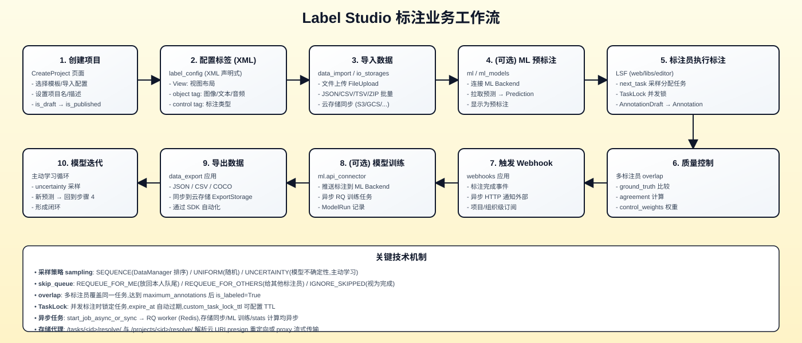
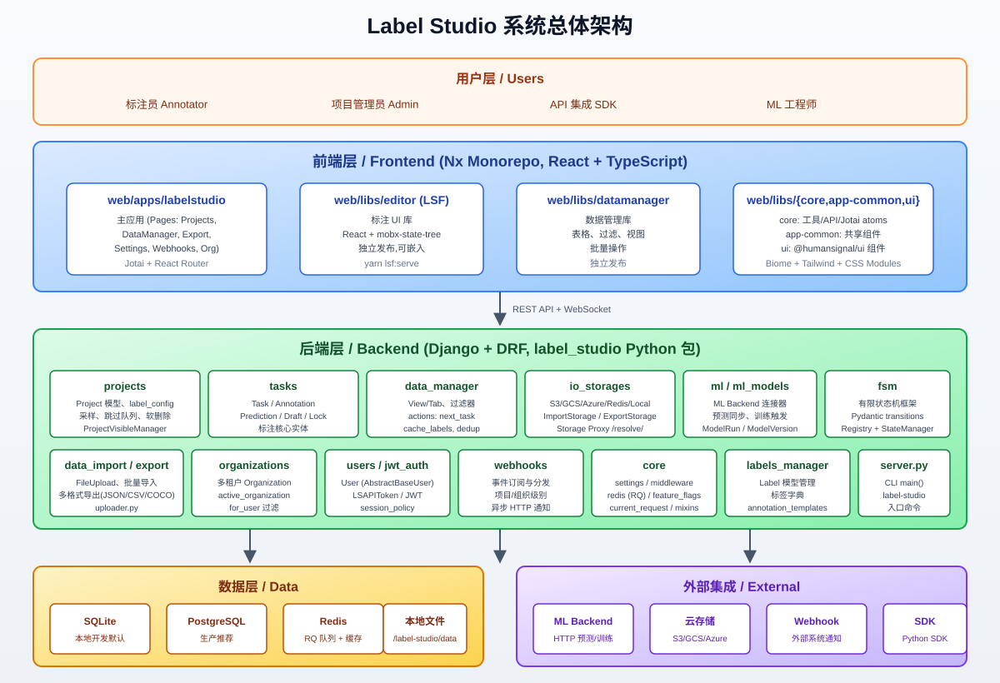
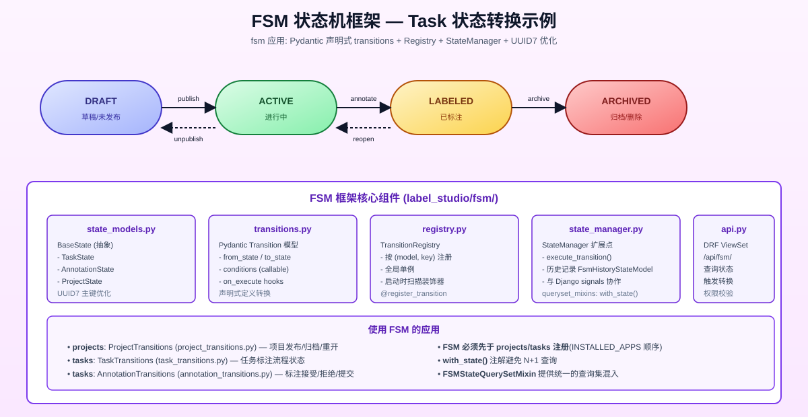
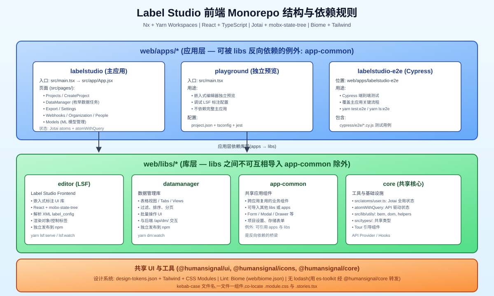
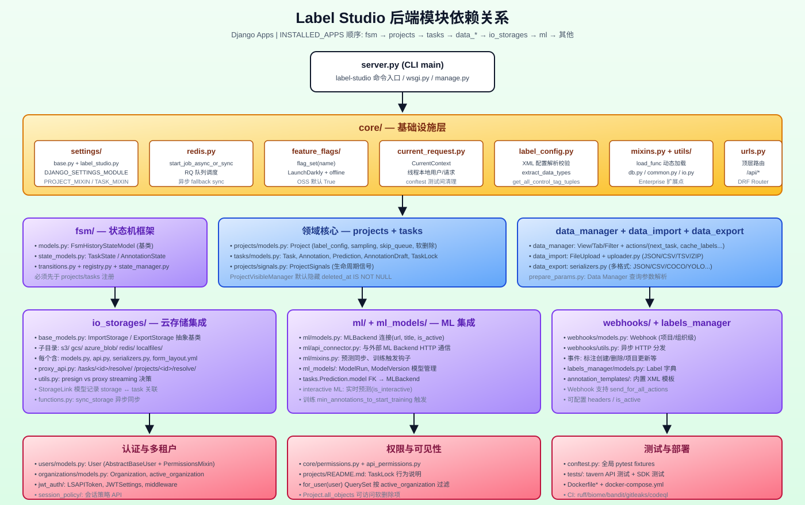
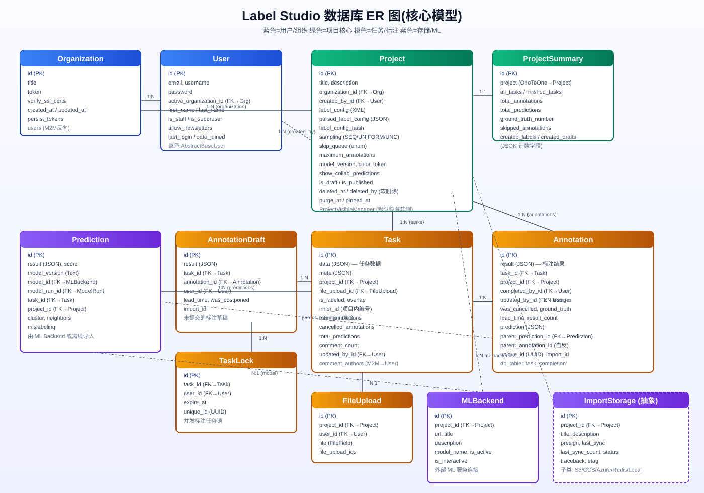

# Label Studio 项目架构文档

> 本文档面向希望深入理解 Label Studio 源码架构的开发者,系统性地介绍项目的业务内容、技术方案、代码结构与各模块详细设计。
>
> - 仓库根目录:`c:\Users\yystj\work\label-studio\label-studio`
> - 版本:见 [label\_studio/__init__.py](file:///c:/Users/yystj/work/label-studio/label-studio/label_studio/__init__.py) 与 [pyproject.toml](file:///c:/Users/yystj/work/label-studio/label-studio/pyproject.toml)
> - 许可证:Apache 2.0

***

## 目录

1. [项目业务内容](#1-项目业务内容)
2. [技术方案与架构](#2-技术方案与架构)
3. [代码结构](#3-代码结构)
4. [各模块目录与详细技术方案](#4-各模块目录与详细技术方案)
5. [数据库 ER 模型](#5-数据库-er-模型)
6. [关键流程](#6-关键流程)

***

## 1. 项目业务内容

### 1.1 业务定位

Label Studio 是一款**开源的多模态数据标注工具**,用于对图像、视频、音频、文本、HTML、PDF、时间序列、3D 等多种数据类型进行人工标注,产出可用于机器学习模型训练的结构化数据。它既可用来从原始数据制备训练集,也可用于改进已有训练数据以提升模型精度。

- **目标用户**:数据科学家、ML 工程师、标注团队管理者、标注员
- **核心价值**:
  - 声明式的 XML 标注配置(label config),可高度自定义界面与标注类型
  - 多人协作标注,支持 overlap(多标注员覆盖)与质量控制
  - 与外部 ML Backend 集成,支持预标注、在线推理与模型训练,可形成主动学习闭环
  - 多种数据导入/导出方式,支持主流云存储
  - Webhook 事件驱动,便于与现有系统集成
  - 通过 Python SDK 可自动化全部流程

### 1.2 支持的数据类型

| 数据类型    | 典型 object tag                      | 说明                                 |
| ------- | ---------------------------------- | ---------------------------------- |
| 图像      | `<Image>`                          | bbox、polygon、keypoint、brush、mask 等 |
| 视频      | `<Video>`、`<VideoRectangle>`       | 时间轴标注、追踪框                          |
| 音频      | `<Audio>`、`<AudioPlus>`            | 波形、段落、转录                           |
| 文本      | `<Text>`                           | NER、分类、情感、摘要                       |
| HTML    | `<HyperText>`                      | 网页标注、对话                            |
| PDF     | `<Pdf>`                            | OCR、文档标注                           |
| 时间序列    | `<Timeseries>`                     | 分类、分割                              |
| 对话/RLHF | `<Paragraphs>`、`<List>`、`<Ranker>` | 多轮对话、排序、评分                         |

### 1.3 支持的标注任务

参考 [docs/source/tags/](file:///c:/Users/yystj/work/label-studio/label-studio/docs/source/tags/) 与 [label\_studio/core/examples/](file:///c:/Users/yystj/work/label-studio/label-studio/label_studio/core/examples/):

- **图像**:目标检测(bbox)、语义分割(polygon、brush)、关键点(keypoint)、多分类、混合标注
- **文本**:命名实体识别(NER)、文本分类、对齐、摘要
- **音频**:语音转录、说话人分离、情感识别
- **视频**:帧标注、目标追踪
- **对话/LLM**:RLHF 排序、回答评分、对话评估、多轮聊天
- **表格**:表格结构标注
- **时序**:时间序列分类、分割
- **PDF/OCR**:版面分析、OCR 校对

### 1.4 业务工作流



完整业务闭环包括 10 个阶段:创建项目 → 配置 XML 标签 → 导入数据 → (可选)ML 预标注 → 标注员执行 → 质量控制 → 触发 Webhook → (可选)训练 → 导出 → 模型迭代回到步骤 4。

### 1.5 部署形态

- **pip 包**:`pip install label-studio` 后运行 `label-studio` 命令(默认 SQLite,自动迁移、自动建默认用户)
- **Docker**:`heartexlabs/label-studio` 镜像,多种 Dockerfile 变体(default / cloudrun / heroku / development / testing / hgface)
- **docker-compose**:Label Studio + Nginx(静态资源/反代)+ PostgreSQL(生产库);可叠加 `docker-compose.minio.yml` 用于本地 S3 测试;`docker-compose.mysql.yml` 用于 MySQL
- **云一键部署**:Heroku / Microsoft Azure / Google Cloud Run(见 [README.md](file:///c:/Users/yystj/work/label-studio/label-studio/README.md) 中的 Deploy 按钮)
- **K8s**:见 [docs/source/guide/install\_k8s.md](file:///c:/Users/yystj/work/label-studio/label-studio/docs/source/guide/install_k8s.md) 与 `helm_values`

***

## 2. 技术方案与架构

### 2.1 总体架构



系统分为五层:

1. **用户层**:标注员、管理员、API/SDK 集成、ML 工程师
2. **前端层**:Nx monorepo(React + TypeScript),由主应用、LSF 编辑器库、Data Manager 库、共享 libs 组成
3. **后端层**:Django + DRF 的 `label_studio` Python 包,按职责拆分为多个 app
4. **数据层**:SQLite(本地)/ PostgreSQL(生产)/ Redis(RQ 队列 + 缓存)/ 本地文件
5. **外部集成**:ML Backend(HTTP)、云存储(S3/GCS/Azure)、Webhook 接收方、Python SDK

前后端通过 REST API 通信;异步任务通过 Redis + RQ 在 worker 中执行;云存储数据通过 Storage Proxy API 流式或预签名 URL 提供。

### 2.2 后端技术栈

| 维度     | 选型                                    | 说明                                                                                                                       |
| ------ | ------------------------------------- | ------------------------------------------------------------------------------------------------------------------------ |
| 语言     | Python ≥ 3.10, < 4                    | 见 [pyproject.toml](file:///c:/Users/yystj/work/label-studio/label-studio/pyproject.toml)                                 |
| Web 框架 | Django + Django REST Framework        | 设置 `DJANGO_SETTINGS_MODULE=core.settings.label_studio`                                                                   |
| 数据库    | SQLite(默认)/ PostgreSQL(生产)/ MySQL(可选) | 同一份迁移需兼容三者,PG 专用 SQL 用 `connection.vendor` 判断                                                                            |
| 异步队列   | Redis + RQ                            | `core.redis.start_job_async_or_sync()`,无 Redis 时回退同步                                                                     |
| API 文档 | drf-spectacular                       | 运行时 `/docs/api/schema/swagger-ui/` 与 `/docs/api/schema/redoc/`                                                           |
| Lint   | Ruff                                  | 行宽 119,单引号,isort 启用                                                                                                      |
| 包管理    | Poetry                                | `poetry install`                                                                                                         |
| 测试     | pytest + tavern                       | `tavern` 用于 API 端点测试,见 [label\_studio/tests/](file:///c:/Users/yystj/work/label-studio/label-studio/label_studio/tests/) |

### 2.3 前端技术栈

| 维度   | 选型                                                         | 说明                                                                                                                         |
| ---- | ---------------------------------------------------------- | -------------------------------------------------------------------------------------------------------------------------- |
| 语言   | TypeScript + 少量 JSX                                        | Biome 校验                                                                                                                   |
| 框架   | React(函数组件)                                                | 无 Context API,全局用 Jotai                                                                                                    |
| 状态管理 | Jotai atoms + `atomWithQuery`(LSF 内部用 mobx-state-tree)     | 见 [web/libs/core/src/atoms/user.ts](file:///c:/Users/yystj/work/label-studio/label-studio/web/libs/core/src/atoms/user.ts) |
| UI 库 | `@humansignal/ui`、`@humansignal/icons`、`@humansignal/core` | UI 组件位于 `web/libs/ui`                                                                                                      |
| 样式   | Tailwind + CSS Modules + 设计令牌                              | [web/design-tokens.json](file:///c:/Users/yystj/work/label-studio/label-studio/web/design-tokens.json)                     |
| Lint | Biome                                                      | [web/biome.json](file:///c:/Users/yystj/work/label-studio/label-studio/web/biome.json)                                     |
| 工具链  | Nx + Yarn Workspaces                                       | `yarn dev` / `yarn build` / `yarn test:unit`                                                                               |
| 工具库  | 禁用 lodash,改用 `es-toolkit` 经 `@humansignal/core` 转发         | 见 [.cursor/rules/no-lodash.mdc](file:///c:/Users/yystj/work/label-studio/label-studio/.cursor/rules/no-lodash.mdc)         |

### 2.4 关键架构模式

#### 2.4.1 配置与 Mixin 动态加载

[label\_studio/core/settings/base.py](file:///c:/Users/yystj/work/label-studio/label-studio/label_studio/core/settings/base.py) 是共享基础,被 [label\_studio/core/settings/label\_studio.py](file:///c:/Users/yystj/work/label-studio/label-studio/label_studio/core/settings/label_studio.py) 继承为 OSS 默认设置;Enterprise 进一步覆盖。

通过 `load_func()` 动态加载 Mixin 实现扩展:

- `settings.PROJECT_MIXIN` → `ProjectMixin`(注入 `Project` 基类)
- `settings.TASK_MIXIN` → `TaskMixin`
- `settings.ANNOTATION_MIXIN` → `AnnotationMixin`
- `settings.RECALCULATE_ALL_STATS` → `recalculate_all_stats`
- `settings.GET_STORAGE_LIST` → 存储类列表

这让 Enterprise 版可以替换/扩展模型行为而不修改 OSS 源码。

#### 2.4.2 Feature Flags

[label\_studio/core/feature\_flags/](file:///c:/Users/yystj/work/label-studio/label-studio/label_studio/core/feature_flags/) 提供 `flag_set("feat_name")` 函数:

- OSS 社区版默认 **offline 模式**,所有 flag 默认 `True`(见 [feature\_flags.json](file:///c:/Users/yystj/work/label-studio/label-studio/label_studio/feature_flags.json))
- Enterprise 接入 LaunchDarkly
- 任何有风险的行为变更应隐藏在 flag 后

#### 2.4.3 当前请求上下文

[label\_studio/core/current\_request.py](file:///c:/Users/yystj/work/label-studio/label-studio/label_studio/core/current_request.py) 中的 `CurrentContext` 使用线程本地存储保存当前 user/request,在模型 `save()` 等深层逻辑中可读取当前操作者;[label\_studio/conftest.py](file:///c:/Users/yystj/work/label-studio/label-studio/label_studio/conftest.py) 在测试之间清理它。

#### 2.4.4 异步任务

[label\_studio/core/redis.py](file:///c:/Users/yystj/work/label-studio/label-studio/label_studio/core/redis.py) 的 `start_job_async_or_sync()`:

- 有 Redis 时入队 RQ worker,异步执行
- 无 Redis 时回退为同步调用
- 用于:云存储同步、ML 训练、stats 计算、异步迁移

#### 2.4.5 软删除与多租户

- `Project` 通过 `deleted_at` / `deleted_by` / `purge_at` 实现软删除
- 默认 manager `ProjectVisibleManager` 隐藏 `deleted_at IS NOT NULL` 的项目;`Project.all_objects` 可访问全部
- 多租户通过 `Organization` 实现:每个 User 有 `active_organization`,`for_user(user)` QuerySet 按 `organization=user.active_organization` 过滤

#### 2.4.6 存储代理 API

[label\_studio/io\_storages/proxy\_api.py](file:///c:/Users/yystj/work/label-studio/label-studio/label_studio/io_storages/proxy_api.py) 提供:

- `/tasks/<id>/resolve/` 和 `/projects/<id>/resolve/` 解析云 URI(如 `s3://bucket/file`)
- 根据存储的 `presign` 标志:
  - `presign=True`:返回预签名 URL(302 重定向,客户端直连云)
  - `presign=False`:服务端流式代理(适用于私有网络或需要审计的场景)

#### 2.4.7 FSM 状态机框架



[label\_studio/fsm/](file:///c:/Users/yystj/work/label-studio/label-studio/label_studio/fsm/) 是高性能有限状态机框架:

- 声明式 Pydantic transitions([transitions.py](file:///c:/Users/yystj/work/label-studio/label-studio/label_studio/fsm/transitions.py))
- 全局注册表 [registry.py](file:///c:/Users/yystj/work/label-studio/label-studio/label_studio/fsm/registry.py)(`@register_transition` 装饰器)
- `StateManager` 扩展点([state\_manager.py](file:///c:/Users/yystj/work/label-studio/label-studio/label_studio/fsm/state_manager.py))
- UUID7 优化的 state 记录([state\_models.py](file:///c:/Users/yystj/work/label-studio/label-studio/label_studio/fsm/state_models.py))— `TaskState`、`AnnotationState`、`ProjectState`
- `FSMStateQuerySetMixin` 提供 `with_state()` 注解,避免 N+1 查询
- **INSTALLED\_APPS 顺序要求**:`fsm` 必须先于 `projects`、`tasks` 注册,因为后两者使用 FSM 转换

#### 2.4.8 信号驱动

[label\_studio/projects/signals.py](file:///c:/Users/yystj/work/label-studio/label-studio/label_studio/projects/signals.py) 中的 `ProjectSignals` 监听 Task/Annotation 的 `post_save`、`post_delete`,自动更新 `ProjectSummary` 计数器、触发 FSM 状态转换、更新 `is_labeled`。

***

## 3. 代码结构

### 3.1 顶层目录

```
label-studio/
├── label_studio/            # Django 后端(pip 包主体)
├── web/                     # 前端 Nx monorepo
├── deploy/                  # Nginx / uwsgi / docker-compose / 云部署
├── docs/                    # Hexo 文档站
├── scripts/                 # build.sh / clean.sh / serve_local_files.sh
├── .github/workflows/       # CI: ruff, biome, bandit, gitleaks, tests
├── .cursor/rules/           # 编码规范
├── pyproject.toml           # Poetry + Ruff 配置
├── Makefile                 # 常用开发命令
├── docker-compose.yml       # LS + Nginx + PostgreSQL
└── Dockerfile*              # 多种 Dockerfile 变体
```

### 3.2 前端 Monorepo 结构



[web/](file:///c:/Users/yystj/work/label-studio/label-studio/web/) 是 Nx + Yarn Workspaces 管理的 monorepo,分为 apps 与 libs 两层。

**导入规则(严格)**:

- `web/apps/*` 可以导入 `web/libs/*`
- `web/libs/*` 之间**不可互相导入**(例外:`app-common` 可以导入其他 libs 与 apps)
- `app-common` 充当反向依赖的桥梁
- 禁用 lodash,改用 `@humansignal/core/lib/utils/*`(es-toolkit 转发)
- 文件命名:kebab-case,一文件一组件,co-locate `.module.css` 与 `.stories.tsx`

| 子项目              | 路径                                                                                                 | 职责                                                                                                                                  |
| ---------------- | -------------------------------------------------------------------------------------------------- | ----------------------------------------------------------------------------------------------------------------------------------- |
| **主应用**          | [web/apps/labelstudio](file:///c:/Users/yystj/work/label-studio/label-studio/web/apps/labelstudio) | 集成所有功能的 React 应用。页面:Projects、CreateProject、DataManager、Export、Settings(Storage/MachineLearning/Webhooks)、Organization/People/Models |
| **playground**   | [web/apps/playground](file:///c:/Users/yystj/work/label-studio/label-studio/web/apps/playground)   | 独立预览应用,用于调试 LSF 标注配置                                                                                                                |
| **Cypress E2E**  | web/apps/labelstudio-e2e                                                                           | 端到端测试                                                                                                                               |
| **LSF 编辑器**      | [web/libs/editor](file:///c:/Users/yystj/work/label-studio/label-studio/web/libs/editor)           | Label Studio Frontend — 嵌入式标注 UI 库,React + mobx-state-tree,可独立运行 `yarn lsf:serve`,独立发布到 npm                                         |
| **Data Manager** | [web/libs/datamanager](file:///c:/Users/yystj/work/label-studio/label-studio/web/libs/datamanager) | 数据探索库,表格/过滤/视图/批量操作,独立发布                                                                                                            |
| **app-common**   | [web/libs/app-common](file:///c:/Users/yystj/work/label-studio/label-studio/web/libs/app-common)   | 共享业务组件,可反向引用 apps                                                                                                                   |
| **core**         | [web/libs/core](file:///c:/Users/yystj/work/label-studio/label-studio/web/libs/core)               | 工具/API Provider/Jotai atoms/Hooks                                                                                                   |
| **ui**           | web/libs/ui                                                                                        | `@humansignal/ui` 组件库                                                                                                               |

### 3.3 后端模块依赖



[label\_studio/](file:///c:/Users/yystj/work/label-studio/label-studio/label_studio/) 内的 Django app 分层:

1. **入口层**:[server.py](file:///c:/Users/yystj/work/label-studio/label-studio/label_studio/server.py)(CLI `main()`)、[core/wsgi.py](file:///c:/Users/yystj/work/label-studio/label-studio/label_studio/core/wsgi.py)、[manage.py](file:///c:/Users/yystj/work/label-studio/label-studio/label_studio/manage.py)
2. **基础设施层 core/**:settings、redis、feature\_flags、current\_request、label\_config、mixins、utils、urls
3. **FSM 框架 fsm/**(必须先注册)
4. **领域核心 projects/ + tasks/**:Project、Task、Annotation、Prediction、AnnotationDraft、TaskLock
5. **数据流 data\_manager/ + data\_import/ + data\_export/**
6. **集成层 io\_storages/ + ml/ + ml\_models/ + webhooks/ + labels\_manager/**
7. **认证层 users/ + organizations/ + jwt\_auth/ + session\_policy/**

***

## 4. 各模块目录与详细技术方案

### 4.1 core/ — 基础设施

[label\_studio/core/](file:///c:/Users/yystj/work/label-studio/label-studio/label_studio/core/)

| 文件/目录                                                                                                                         | 职责                                                                                                                                                                                        |
| ----------------------------------------------------------------------------------------------------------------------------- | ----------------------------------------------------------------------------------------------------------------------------------------------------------------------------------------- |
| [settings/base.py](file:///c:/Users/yystj/work/label-studio/label-studio/label_studio/core/settings/base.py)                  | 共享基础设置:DATABASES、LOGGING、MIDDLEWARE、AUTH、INSTALLED\_APPS 顺序、PROJECT\_MIXIN/TASK\_MIXIN 等                                                                                                  |
| [settings/label\_studio.py](file:///c:/Users/yystj/work/label-studio/label-studio/label_studio/core/settings/label_studio.py) | OSS 默认 `DJANGO_SETTINGS_MODULE`,覆盖 base                                                                                                                                                   |
| [redis.py](file:///c:/Users/yystj/work/label-studio/label-studio/label_studio/core/redis.py)                                  | `start_job_async_or_sync(func, *args)` — Redis 可用时入 RQ,否则同步执行                                                                                                                             |
| [current\_request.py](file:///c:/Users/yystj/work/label-studio/label-studio/label_studio/core/current_request.py)             | `CurrentContext` 线程本地存储,`get_current_request()` 在深层读取                                                                                                                                     |
| [label\_config.py](file:///c:/Users/yystj/work/label-studio/label-studio/label_studio/core/label_config.py)                   | XML 标注配置解析:`validate_label_config`、`extract_data_types`、`get_all_control_tag_tuples`、`get_sample_task`                                                                                    |
| [mixins.py](file:///c:/Users/yystj/work/label-studio/label-studio/label_studio/core/mixins.py)                                | `load_func()` 动态加载 Enterprise Mixin                                                                                                                                                       |
| [feature\_flags/](file:///c:/Users/yystj/work/label-studio/label-studio/label_studio/core/feature_flags/)                     | `flag_set(name)` + offline 默认值([feature\_flags.json](file:///c:/Users/yystj/work/label-studio/label-studio/label_studio/feature_flags.json))                                              |
| [utils/](file:///c:/Users/yystj/work/label-studio/label-studio/label_studio/core/utils/)                                      | common.py(load\_func, create\_hash, merge\_labels\_counters)、db.py(batch\_update\_with\_retry, fast\_first, has\_column\_cached)、io.py、params.py(get\_env)、formatter.py、sentry.py、mail.py |
| [urls.py](file:///c:/Users/yystj/work/label-studio/label-studio/label_studio/core/urls.py)                                    | 顶层 URL 路由,DRF Router 注册各 app ViewSet                                                                                                                                                      |
| [permissions.py](file:///c:/Users/yystj/work/label-studio/label-studio/label_studio/core/permissions.py)                      | 通用 DRF 权限类                                                                                                                                                                                |
| [middleware.py](file:///c:/Users/yystj/work/label-studio/label-studio/label_studio/core/middleware.py)                        | 自定义中间件                                                                                                                                                                                    |
| [storage.py](file:///c:/Users/yystj/work/label-studio/label-studio/label_studio/core/storage.py)                              | Django 文件存储后端                                                                                                                                                                             |
| [argparser.py](file:///c:/Users/yystj/work/label-studio/label-studio/label_studio/core/argparser.py)                          | CLI 参数解析                                                                                                                                                                                  |
| [version.py](file:///c:/Users/yystj/work/label-studio/label-studio/label_studio/core/version.py)                              | 版本号                                                                                                                                                                                       |
| [validators.py](file:///c:/Users/yystj/work/label-studio/label-studio/label_studio/core/validators.py)                        | 校验器                                                                                                                                                                                       |
| [bulk\_update\_utils.py](file:///c:/Users/yystj/work/label-studio/label-studio/label_studio/core/bulk_update_utils.py)        | `bulk_update` 批量更新工具                                                                                                                                                                      |
| [migration\_helpers.py](file:///c:/Users/yystj/work/label-studio/label-studio/label_studio/core/migration_helpers.py)         | 迁移辅助                                                                                                                                                                                      |

### 4.2 fsm/ — 有限状态机框架

[label\_studio/fsm/](file:///c:/Users/yystj/work/label-studio/label-studio/label_studio/fsm/),详见 [fsm/README.md](file:///c:/Users/yystj/work/label-studio/label-studio/label_studio/fsm/README.md)

| 文件                                                                                                                             | 职责                                                                         |
| ------------------------------------------------------------------------------------------------------------------------------ | -------------------------------------------------------------------------- |
| [models.py](file:///c:/Users/yystj/work/label-studio/label-studio/label_studio/fsm/models.py)                                  | `FsmHistoryStateModel` 抽象基类,被 Project/Task/Annotation 继承,提供状态历史字段          |
| [state\_models.py](file:///c:/Users/yystj/work/label-studio/label-studio/label_studio/fsm/state_models.py)                     | `BaseState` + `TaskState`/`AnnotationState`/`ProjectState`,UUID7 主键优化      |
| [state\_choices.py](file:///c:/Users/yystj/work/label-studio/label-studio/label_studio/fsm/state_choices.py)                   | 状态枚举(DRAFT/ACTIVE/LABELED/ARCHIVED 等)                                      |
| [transitions.py](file:///c:/Users/yystj/work/label-studio/label-studio/label_studio/fsm/transitions.py)                        | Pydantic `Transition` 模型:`from_state`/`to_state`/`conditions`/`on_execute` |
| [registry.py](file:///c:/Users/yystj/work/label-studio/label-studio/label_studio/fsm/registry.py)                              | `TransitionRegistry` 全局单例,`@register_transition` 装饰器                       |
| [state\_manager.py](file:///c:/Users/yystj/work/label-studio/label-studio/label_studio/fsm/state_manager.py)                   | `StateManager.execute_transition()`,写历史记录                                  |
| [transition\_executor.py](file:///c:/Users/yystj/work/label-studio/label-studio/label_studio/fsm/transition_executor.py)       | 转换执行器                                                                      |
| [queryset\_mixins.py](file:///c:/Users/yystj/work/label-studio/label-studio/label_studio/fsm/queryset_mixins.py)               | `FSMStateQuerySetMixin` — 提供 `with_state()` 注解                             |
| [project\_transitions.py](file:///c:/Users/yystj/work/label-studio/label-studio/label_studio/fsm/project_transitions.py)       | Project 转换:发布/归档/重开                                                        |
| [task\_transitions.py](file:///c:/Users/yystj/work/label-studio/label-studio/label_studio/fsm/task_transitions.py)             | Task 转换                                                                    |
| [annotation\_transitions.py](file:///c:/Users/yystj/work/label-studio/label-studio/label_studio/fsm/annotation_transitions.py) | Annotation 转换(接受/拒绝/提交)                                                    |
| [api.py](file:///c:/Users/yystj/work/label-studio/label-studio/label_studio/fsm/api.py)                                        | DRF ViewSet,`/api/fsm/`                                                    |
| [functions.py](file:///c:/Users/yystj/work/label-studio/label-studio/label_studio/fsm/functions.py)                            | `update_task_state_after_annotation_deletion` 等                            |

### 4.3 projects/ — 项目管理

[label\_studio/projects/](file:///c:/Users/yystj/work/label-studio/label-studio/label_studio/projects/)

| 文件                                                                                                   | 职责                                                                       |
| ---------------------------------------------------------------------------------------------------- | ------------------------------------------------------------------------ |
| [models.py](file:///c:/Users/yystj/work/label-studio/label-studio/label_studio/projects/models.py)   | `Project` 模型 + `ProjectVisibleManager`/`ProjectManager`/`ProjectSummary` |
| [api.py](file:///c:/Users/yystj/work/label-studio/label-studio/label_studio/projects/api.py)         | ProjectViewSet、ProjectSummarySerializer                                  |
| [views.py](file:///c:/Users/yystj/work/label-studio/label-studio/label_studio/projects/views.py)     | HTML 视图                                                                  |
| [signals.py](file:///c:/Users/yystj/work/label-studio/label-studio/label_studio/projects/signals.py) | `ProjectSignals` — Task/Annotation 信号钩子                                  |
| [mixins.py](file:///c:/Users/yystj/work/label-studio/label-studio/label_studio/projects/mixins.py)   | Project 业务方法                                                             |
| [functions/](file:///c:/Users/yystj/work/label-studio/label-studio/label_studio/projects/functions)  | annotate\_task\_number 等统计注解函数                                           |

**Project 模型关键字段**:

- 标注配置:`label_config`(XML)、`parsed_label_config`(JSON)、`label_config_hash`
- 采样:`sampling`(`SEQUENCE`/`UNIFORM`/`UNCERTAINTY`)、`skip_queue`(`REQUEUE_FOR_ME`/`REQUEUE_FOR_OTHERS`/`IGNORE_SKIPPED`)
- 标注上限:`maximum_annotations`(达到后 `is_labeled=True`)、`min_annotations_to_start_training`
- UI 开关:`show_instruction`、`show_skip_button`、`enable_empty_annotation`、`show_collab_predictions`、`reveal_preannotations_interactively`、`show_annotation_history`
- 软删除:`deleted_at`、`deleted_by`、`purge_at`
- 其他:`token`、`color`、`model_version`、`control_weights`(JSON)、`is_draft`/`is_published`、`pinned_at`、`custom_task_lock_ttl`、`task_data_login`/`task_data_password`(数据访问凭证)、`annotator_evaluation_enabled`

### 4.4 tasks/ — 任务与标注

[label\_studio/tasks/](file:///c:/Users/yystj/work/label-studio/label-studio/label_studio/tasks/)

| 文件                                                                                                        | 职责                                                            |
| --------------------------------------------------------------------------------------------------------- | ------------------------------------------------------------- |
| [models.py](file:///c:/Users/yystj/work/label-studio/label-studio/label_studio/tasks/models.py)           | `Task`、`Annotation`、`Prediction`、`AnnotationDraft`、`TaskLock` |
| [api.py](file:///c:/Users/yystj/work/label-studio/label-studio/label_studio/tasks/api.py)                 | TaskViewSet、AnnotationViewSet 等                               |
| [serializers.py](file:///c:/Users/yystj/work/label-studio/label-studio/label_studio/tasks/serializers.py) | DRF 序列化器                                                      |
| [choices.py](file:///c:/Users/yystj/work/label-studio/label-studio/label_studio/tasks/choices.py)         | `ActionType` 枚举                                               |
| [functions.py](file:///c:/Users/yystj/work/label-studio/label-studio/label_studio/tasks/functions.py)     | 业务函数                                                          |
| [validation.py](file:///c:/Users/yystj/work/label-studio/label-studio/label_studio/tasks/validation.py)   | 标注结果校验                                                        |
| [exceptions.py](file:///c:/Users/yystj/work/label-studio/label-studio/label_studio/tasks/exceptions.py)   | 自定义异常                                                         |

**核心模型**:

- **Task**:`data`(JSON,任务数据)、`meta`、`project` FK、`is_labeled`、`overlap`、`inner_id`(项目内编号)、`total_annotations`/`cancelled_annotations`/`total_predictions`、`comment_count`/`unresolved_comment_count`、`comment_authors`(M2M→User)、`file_upload` FK
- **Annotation**:`result`(JSON,标注结果)、`task`/`project` FK、`completed_by`/`updated_by` FK、`was_cancelled`、`ground_truth`、`lead_time`、`prediction`(JSON,提交时所见预测)、`parent_prediction`/`parent_annotation` FK(版本溯源)、`unique_id`(UUID)、`import_id`、`last_action`、`bulk_created`。`db_table='task_completion'`(历史命名)
- **Prediction**:`result`/`score`/`model_version`、`model` FK→`MLBackend`、`model_run` FK→`ModelRun`、`task`/`project` FK、`cluster`/`neighbors`(主动学习)、`mislabeling`
- **AnnotationDraft**:未提交草稿,`result`/`lead_time`/`task`/`annotation`/`user` FK、`was_postponed`、`import_id`。`save()`/`delete()` 时按顺序锁 `ProjectSummary` 防死锁
- **TaskLock**:`task`/`user` FK、`expire_at`、`unique_id`(UUID)。并发标注任务锁,可由 `custom_task_lock_ttl` 配置 TTL

### 4.5 data\_manager/ — 数据管理

[label\_studio/data\_manager/](file:///c:/Users/yystj/work/label-studio/label-studio/label_studio/data_manager/)

| 文件/目录                                                                                                                                                            | 职责                                                   |
| ---------------------------------------------------------------------------------------------------------------------------------------------------------------- | ---------------------------------------------------- |
| [models.py](file:///c:/Users/yystj/work/label-studio/label-studio/label_studio/data_manager/models.py)                                                           | `View`(过滤器+排序+字段)、`Tab`                              |
| [api.py](file:///c:/Users/yystj/work/label-studio/label-studio/label_studio/data_manager/api.py)                                                                 | ViewViewSet,POST `/api/dm/views/<id>/next` 取下一任务     |
| [managers.py](file:///c:/Users/yystj/work/label-studio/label-studio/label_studio/data_manager/managers.py)                                                       | `PreparedTaskManager`/`TaskManager` — 应用 View 的过滤/排序 |
| [prepare\_params.py](file:///c:/Users/yystj/work/label-studio/label-studio/label_studio/data_manager/prepare_params.py)                                          | 解析前端查询参数为 ORM 查询                                     |
| [functions.py](file:///c:/Users/yystj/work/label-studio/label-studio/label_studio/data_manager/functions.py)                                                     | 过滤/排序函数注册                                            |
| [actions/next\_task.py](file:///c:/Users/yystj/work/label-studio/label-studio/label_studio/data_manager/actions/next_task.py)                                    | **下一任务分配** — 按 `sampling` 策略选择任务,加 TaskLock          |
| [actions/cache\_labels.py](file:///c:/Users/yystj/work/label-studio/label-studio/label_studio/data_manager/actions/cache_labels.py)                              | 预计算并缓存标注统计                                           |
| [actions/predictions\_to\_annotations.py](file:///c:/Users/yystj/work/label-studio/label-studio/label_studio/data_manager/actions/predictions_to_annotations.py) | 批量将预测转标注                                             |
| [actions/remove\_duplicates.py](file:///c:/Users/yystj/work/label-studio/label-studio/label_studio/data_manager/actions/remove_duplicates.py)                    | 去重                                                   |
| [actions/basic.py](file:///c:/Users/yystj/work/label-studio/label-studio/label_studio/data_manager/actions/basic.py)                                             | 删除/标注等基础批量操作                                         |
| [actions/experimental.py](file:///c:/Users/yystj/work/label-studio/label-studio/label_studio/data_manager/actions/experimental.py)                               | 实验性操作                                                |

### 4.6 data\_import/ 与 data\_export/

[label\_studio/data\_import/](file:///c:/Users/yystj/work/label-studio/label-studio/label_studio/data_import/):

- [models.py](file:///c:/Users/yystj/work/label-studio/label-studio/label_studio/data_import/models.py) — `FileUpload`(file FileField、project/user FK、file\_upload\_ids)
- [uploader.py](file:///c:/Users/yystj/work/label-studio/label-studio/label_studio/data_import/uploader.py) — 支持 JSON/CSV/TSV/TXT/ZIP/RAR/音频/图像/视频等格式解析为 Task
- [functions.py](file:///c:/Users/yystj/work/label-studio/label-studio/label_studio/data_import/functions.py) — `upload_data`、`import_data` 异步导入

[label\_studio/data\_export/](file:///c:/Users/yystj/work/label-studio/label-studio/label_studio/data_export/):

- [models.py](file:///c:/Users/yystj/work/label-studio/label-studio/label_studio/data_export/models.py) — 导出任务记录
- [serializers.py](file:///c:/Users/yystj/work/label-studio/label-studio/label_studio/data_export/serializers.py) — 多格式导出器:JSON/CSV/COCO/YOLO/VOC 等
- [mixins.py](file:///c:/Users/yystj/work/label-studio/label-studio/label_studio/data_export/mixins.py) — 导出混入
- [api.py](file:///c:/Users/yystj/work/label-studio/label-studio/label_studio/data_export/api.py) — `/api/projects/<id>/export`

### 4.7 io\_storages/ — 云存储集成

[label\_studio/io\_storages/](file:///c:/Users/yystj/work/label-studio/label-studio/label_studio/io_storages/),详见 [README.md](file:///c:/Users/yystj/work/label-studio/label-studio/label_studio/io_storages/README.md)

| 子目录/文件                                                                                                           | 职责                                                                              |
| ---------------------------------------------------------------------------------------------------------------- | ------------------------------------------------------------------------------- |
| [base\_models.py](file:///c:/Users/yystj/work/label-studio/label-studio/label_studio/io_storages/base_models.py) | `ImportStorage`/`ExportStorage` 抽象基类 + `StorageLink` 关联表                        |
| [s3/](file:///c:/Users/yystj/work/label-studio/label-studio/label_studio/io_storages/s3)                         | `S3ImportStorage`/`S3ExportStorage` + api/models/serializers/form\_layout/utils |
| [gcs/](file:///c:/Users/yystj/work/label-studio/label-studio/label_studio/io_storages/gcs)                       | Google Cloud Storage                                                            |
| [azure\_blob/](file:///c:/Users/yystj/work/label-studio/label-studio/label_studio/io_storages/azure_blob)        | Azure Blob Storage                                                              |
| [redis/](file:///c:/Users/yystj/work/label-studio/label-studio/label_studio/io_storages/redis)                   | Redis 存储(实验性)                                                                   |
| [localfiles/](file:///c:/Users/yystj/work/label-studio/label-studio/label_studio/io_storages/localfiles)         | 本地文件存储,含独立 views                                                                |
| [proxy\_api.py](file:///c:/Users/yystj/work/label-studio/label-studio/label_studio/io_storages/proxy_api.py)     | `/tasks/<id>/resolve/`、`/projects/<id>/resolve/`                                |
| [utils.py](file:///c:/Users/yystj/work/label-studio/label-studio/label_studio/io_storages/utils.py)              | presign vs proxy 决策、URL 解析                                                      |
| [functions.py](file:///c:/Users/yystj/work/label-studio/label-studio/label_studio/io_storages/functions.py)      | `sync_storage` 异步同步                                                             |
| [all\_api.py](file:///c:/Users/yystj/work/label-studio/label-studio/label_studio/io_storages/all_api.py)         | 统一 API 路由                                                                       |
| [filesystem.py](file:///c:/Users/yystj/work/label-studio/label-studio/label_studio/io_storages/filesystem.py)    | 文件系统抽象                                                                          |

每个 provider 子目录结构一致:`models.py`(存储模型)、`api.py`(DRF ViewSet)、`serializers.py`、`form_layout.yml`(前端表单布局)、`openapi_schema.py`(OpenAPI)、`utils.py`(云 SDK 封装)。

### 4.8 ml/ 与 ml\_models/ — ML 集成

[label\_studio/ml/](file:///c:/Users/yystj/work/label-studio/label-studio/label_studio/ml/),详见 [README.md](file:///c:/Users/yystj/work/label-studio/label-studio/label_studio/ml/README.md)

| 文件                                                                                                          | 职责                                                            |
| ----------------------------------------------------------------------------------------------------------- | ------------------------------------------------------------- |
| [models.py](file:///c:/Users/yystj/work/label-studio/label-studio/label_studio/ml/models.py)                | `MLBackend`(url、title、is\_active、is\_interactive、model\_name) |
| [api\_connector.py](file:///c:/Users/yystj/work/label-studio/label-studio/label_studio/ml/api_connector.py) | 与外部 ML Backend HTTP 通信:拉取预测、推送训练数据、触发训练                       |
| [mixins.py](file:///c:/Users/yystj/work/label-studio/label-studio/label_studio/ml/mixins.py)                | 预测同步、训练触发钩子                                                   |
| [api.py](file:///c:/Users/yystj/work/label-studio/label-studio/label_studio/ml/api.py)                      | MLBackendViewSet                                              |
| [serializers.py](file:///c:/Users/yystj/work/label-studio/label-studio/label_studio/ml/serializers.py)      | 序列化器                                                          |

[label\_studio/ml\_models/](file:///c:/Users/yystj/work/label-studio/label-studio/label_studio/ml_models/):

- `ModelRun`、`ModelVersion` 模型,与 `Prediction.model_run` FK 关联,用于追踪模型版本

**ML Backend 协议**:

- 外部 ML Backend 是独立的 Flask/FastAPI 服务(见 [label-studio-ml-backend](https://github.com/HumanSignal/label-studio-ml-backend))
- `is_interactive=True` 时支持在线推理(LSF 实时调用)
- 训练触发条件:`min_annotations_to_start_training`
- 异步通过 `start_job_async_or_sync` 在 RQ worker 中执行

### 4.9 webhooks/

[label\_studio/webhooks/](file:///c:/Users/yystj/work/label-studio/label-studio/label_studio/webhooks/)

| 文件                                                                                                 | 职责                                                                                                |
| -------------------------------------------------------------------------------------------------- | ------------------------------------------------------------------------------------------------- |
| [models.py](file:///c:/Users/yystj/work/label-studio/label-studio/label_studio/webhooks/models.py) | `Webhook`(url、is\_active、send\_for\_all\_actions、headers、project/organization FK、target\_project) |
| [api.py](file:///c:/Users/yystj/work/label-studio/label-studio/label_studio/webhooks/api.py)       | WebhookViewSet                                                                                    |
| [utils.py](file:///c:/Users/yystj/work/label-studio/label-studio/label_studio/webhooks/utils.py)   | 异步 HTTP 分发,支持重试                                                                                   |
| [apps.py](file:///c:/Users/yystj/work/label-studio/label-studio/label_studio/webhooks/apps.py)     | 信号注册,监听 Task/Annotation/Project 事件                                                                |

### 4.10 users/、organizations/、jwt\_auth/、session\_policy/

| 应用                                                                                                     | 关键内容                                                                                                                                                                                    |
| ------------------------------------------------------------------------------------------------------ | --------------------------------------------------------------------------------------------------------------------------------------------------------------------------------------- |
| [users/](file:///c:/Users/yystj/work/label-studio/label-studio/label_studio/users/)                    | `User`(继承 `AbstractBaseUser` + `PermissionsMixin`):email/username/password/active\_organization\_id,自定义 `UserManager`                                                                   |
| [organizations/](file:///c:/Users/yystj/work/label-studio/label-studio/label_studio/organizations/)    | `Organization`:title/token/verify\_ssl\_certs/persist\_tokens;多租户隔离通过 `active_organization`                                                                                             |
| [jwt\_auth/](file:///c:/Users/yystj/work/label-studio/label-studio/label_studio/jwt_auth/)             | `LSAPIToken`(DRF 认证后端)、`TruncatedLSAPIToken`(列表脱敏)、`JWTSettings`(组织级 JWT 配置)、[middleware.py](file:///c:/Users/yystj/work/label-studio/label-studio/label_studio/jwt_auth/middleware.py) |
| [session\_policy/](file:///c:/Users/yystj/work/label-studio/label-studio/label_studio/session_policy/) | 会话策略模型与 API                                                                                                                                                                             |

### 4.11 labels\_manager/ 与 annotation\_templates/

- [labels\_manager/](file:///c:/Users/yystj/work/label-studio/label-studio/label_studio/labels_manager/) — `Label` 模型管理标签字典
- [label\_studio/annotation\_templates/](file:///c:/Users/yystj/work/label-studio/label-studio/label_studio/annotation_templates/) — 内置 XML/YAML 标注配置模板(对应 [core/examples/](file:///c:/Users/yystj/work/label-studio/label-studio/label_studio/core/examples/) 中的示例 config.xml)

### 4.12 server.py — CLI 入口

[label\_studio/server.py](file:///c:/Users/yystj/work/label-studio/label-studio/label_studio/server.py) 的 `main()` 是 `label-studio` 命令入口:

```bash
label-studio                                          # 启动服务(自动迁移、建默认用户)
label-studio start --log-level DEBUG                  # 启动 + 调试日志
label-studio init --project-name myproject            # 初始化项目
label-studio user --username default_user@localhost   # 打印用户信息 + token
label-studio reset_password --username ...            # 重置密码
label-studio export <project_id> <format> <path>      # 导出项目
```

***

## 5. 数据库 ER 模型



### 5.1 核心实体关系

| 实体                                    | 关系     | 说明                                                  |
| ------------------------------------- | ------ | --------------------------------------------------- |
| Organization → User                   | 1:N    | 一个组织有多个用户,User 通过 `active_organization_id` 反向指向当前组织 |
| Organization → Project                | 1:N    | `Project.organization` FK                           |
| User → Project                        | 1:N    | `Project.created_by`(SET\_NULL)                     |
| Project → ProjectSummary              | 1:1    | OneToOne,缓存项目统计计数                                   |
| Project → Task                        | 1:N    | `Task.project` FK(CASCADE)                          |
| Task → Annotation                     | 1:N    | `Annotation.task` FK(CASCADE)                       |
| Project → Annotation                  | 1:N    | `Annotation.project`(冗余 FK,性能优化)                    |
| Task → Prediction                     | 1:N    | `Prediction.task` FK                                |
| MLBackend → Prediction                | 1:N    | `Prediction.model` FK                               |
| ModelRun → Prediction                 | 1:N    | `Prediction.model_run` FK                           |
| Annotation → Prediction               | N:1    | `Annotation.parent_prediction`(SET\_NULL,溯源)        |
| Annotation → Annotation               | 自反 N:1 | `Annotation.parent_annotation`(版本链)                 |
| User → Annotation                     | 1:N    | `Annotation.completed_by`/`updated_by`(SET\_NULL)   |
| Task → AnnotationDraft                | 1:N    | `AnnotationDraft.task`                              |
| Annotation → AnnotationDraft          | 1:N    | `AnnotationDraft.annotation`                        |
| Task → TaskLock                       | 1:N    | `TaskLock.task`,并发标注锁                               |
| Task → FileUpload                     | N:1    | `Task.file_upload`(SET\_NULL)                       |
| Task → User (comment\_authors)        | M2M    | `Task.comment_authors` 评论作者                         |
| Project → MLBackend                   | 1:N    | `MLBackend.project`                                 |
| Project → ImportStorage/ExportStorage | 1:N    | 各存储 provider 子类的 `project` FK                       |
| Storage ↔ Task                        | M:N    | 通过 `StorageLink` 关联表                                |
| Organization → Webhook                | 1:N    | 组织级 Webhook                                         |
| Project → Webhook                     | 1:N    | 项目级 Webhook                                         |
| Organization → JWTSettings            | 1:1    | 组织级 JWT 配置                                          |

### 5.2 软删除与可见性

`Project` 使用 `deleted_at`/`deleted_by`/`purge_at` 实现软删除:

- 默认 `Project.objects`(`ProjectVisibleManager`)隐藏 `deleted_at IS NOT NULL`
- `Project.all_objects`(`ProjectManager`)可访问全部(用于管理员或清理任务)
- `purge_at` 用于计划硬删除时间

### 5.3 多数据库兼容

- **SQLite**(默认,本地开发)、**PostgreSQL**(生产)、**MySQL**(可选)
- 所有迁移必须同时兼容三者
- PG 专用 SQL(`CREATE INDEX CONCURRENTLY`、BRIN/GIN 索引)用 `connection.vendor == 'postgresql'` 判断
- 长时间 schema 变更使用**异步迁移**([.cursor/rules/async\_migrations.mdc](file:///c:/Users/yystj/work/label-studio/label-studio/.cursor/rules/async_migrations.mdc)):`atomic = False`,通过 `start_job_async_or_sync` 入队 DDL,记录在 `AsyncMigrationStatus`,PG 用 `CREATE INDEX CONCURRENTLY`,SQLite 提供回退

***

## 6. 关键流程

### 6.1 下一任务分配(next\_task)

`POST /api/dm/views/<view_id>/next` → [data\_manager/actions/next\_task.py](file:///c:/Users/yystj/work/label-studio/label-studio/label_studio/data_manager/actions/next_task.py):

1. 加载 `View`(过滤器、排序)
2. 按 `project.sampling` 选择策略:
   - `SEQUENCE`:按 DataManager 排序顺序
   - `UNIFORM`:随机选择
   - `UNCERTAINTY`:按模型不确定性分数(主动学习)
3. 应用 `skip_queue` 策略排除已跳过任务
4. 创建 `TaskLock`(`expire_at` = now + `custom_task_lock_ttl` 或默认 TTL)
5. 返回 Task + 关联的 Prediction(若 `show_collab_predictions`)

### 6.2 标注提交

`POST /api/tasks/<id>/annotations` → [tasks/api.py](file:///c:/Users/yystj/work/label-studio/label-studio/label_studio/tasks/api.py):

1. `Annotation.save()` 设置 `completed_by`/`updated_by`(`get_current_request()`)
2. 更新 `Task.total_annotations`、`is_labeled`(达到 `maximum_annotations` 时 True)
3. `ProjectSignals` 更新 `ProjectSummary` 计数器
4. FSM 转换 Task 状态(`update_project_state_after_task_change`)
5. 若配置了 Webhook,异步发送通知
6. 若达到 `min_annotations_to_start_training`,触发 ML 训练

### 6.3 云存储同步

[label\_studio/io\_storages/functions.py](file:///c:/Users/yystj/work/label-studio/label-studio/label_studio/io_storages/functions.py) 的 `sync_storage`:

1. 通过 `start_job_async_or_sync` 入队 RQ
2. 调用 provider 的 `scan_and_create_links`(遍历云对象)
3. 为每个对象创建 `StorageLink`(storage ↔ task)
4. 更新 `ImportStorage.last_sync`、`last_sync_count`、`status`
5. 失败记录 `traceback`

### 6.4 存储代理解析

`GET /tasks/<id>/resolve/` → [io\_storages/proxy\_api.py](file:///c:/Users/yystj/work/label-studio/label-studio/label_studio/io_storages/proxy_api.py):

1. 找到 Task 关联的 `StorageLink` → `ImportStorage`
2. 调用 `storage.resolve_uri(task.data)` 得到云 URI
3. 若 `storage.presign == True`:生成预签名 URL,返回 302 重定向(客户端直连云)
4. 若 `storage.presign == False`:服务端流式代理(流式读取云对象并转发)

### 6.5 异步迁移

参见 [core/async\_migrations.md](file:///c:/Users/yystj/work/label-studio/label-studio/label_studio/core/async_migrations.md) 与 [migration\_helpers.py](file:///c:/Users/yystj/work/label-studio/label-studio/label_studio/core/migration_helpers.py):

1. 迁移文件设置 `atomic = False`
2. 通过 `start_job_async_or_sync` 入队真正的 DDL
3. `AsyncMigrationStatus` 模型跟踪进度
4. PG 使用 `CREATE INDEX CONCURRENTLY`,SQLite 提供兼容回退
5. `ALLOW_SCHEDULED_MIGRATIONS` 控制是否允许调度状态

***

## 附录:常用开发命令

### 后端

```bash
poetry install                              # 安装 Python 依赖
DJANGO_DB=sqlite poetry run python label_studio/manage.py migrate
DJANGO_DB=sqlite poetry run python label_studio/manage.py runserver   # http://localhost:8080

# Make 目标
make run-dev          # Django dev server + sqlite
make migrate-dev      # 迁移
make makemigrations-dev
make shell-dev        # shell_plus
make test             # pytest -v -m "not integration_tests"
make frontend-dev     # yarn dev (HMR)
make frontend-build   # yarn build
make fmt              # pre-commit run on changed files
make generate-swagger # 重新生成 swagger.json
```

### 前端

```bash
cd web && yarn install --frozen-lockfile
yarn dev            # HMR dev server(需 FRONTEND_HMR=true)
yarn ls:dev         # 主应用 dev with HMR
yarn lsf:watch      # editor 持续构建
yarn dm:watch       # datamanager 持续构建
yarn build          # 生产构建
yarn test:unit      # 全部单元测试
yarn test:e2e       # cypress E2E
yarn lint           # biome check --write .
```

### 测试

```bash
cd label_studio
DJANGO_DB=sqlite DJANGO_SETTINGS_MODULE=core.settings.label_studio pytest -vv           # sqlite
DJANGO_DB=default DJANGO_SETTINGS_MODULE=core.settings.label_studio pytest -vv          # postgres
```

### Docker

```bash
docker pull heartexlabs/label-studio:latest
docker run -it -p 8080:8080 -v $(pwd)/mydata:/label-studio/data heartexlabs/label-studio:latest
docker-compose up                                                  # LS + Nginx + Postgres
docker compose -f docker-compose.yml -f docker-compose.minio.yml up -d   # 含 MinIO 本地 S3 测试
```

***

## 参考文档

- [README.md](file:///c:/Users/yystj/work/label-studio/label-studio/README.md) — 安装与使用
- [CONTRIBUTING.md](file:///c:/Users/yystj/work/label-studio/label-studio/CONTRIBUTING.md) — 贡献指南
- [AGENTS.md](file:///c:/Users/yystj/work/label-studio/label-studio/AGENTS.md) — AI Agent 工作指南
- [web/README.md](file:///c:/Users/yystj/work/label-studio/label-studio/web/README.md) — 前端安装与命令
- [DESIGN.md](file:///c:/Users/yystj/work/label-studio/label-studio/DESIGN.md) — 设计系统、令牌、可访问性
- [label\_studio/io\_storages/README.md](file:///c:/Users/yystj/work/label-studio/label-studio/label_studio/io_storages/README.md) — 云存储架构、代理 API
- [label\_studio/fsm/README.md](file:///c:/Users/yystj/work/label-studio/label-studio/label_studio/fsm/README.md) — FSM 框架用法
- [label\_studio/projects/README.md](file:///c:/Users/yystj/work/label-studio/label-studio/label_studio/projects/README.md) — 任务锁行为
- [label\_studio/ml/README.md](file:///c:/Users/yystj/work/label-studio/label-studio/label_studio/ml/README.md) — ML Backend 集成
- [.cursor/rules/](file:///c:/Users/yystj/work/label-studio/label-studio/.cursor/rules/) — 编码规范
- [docs/source/guide/](file:///c:/Users/yystj/work/label-studio/label-studio/docs/source/guide/) — 用户文档

## 生态系统

| 项目                                                                                | 说明                                              |
| --------------------------------------------------------------------------------- | ----------------------------------------------- |
| **label-studio**(本仓库)                                                             | 服务端,以 pip 包分发                                   |
| [label-studio-frontend](https://github.com/HumanSignal/label-studio-frontend)     | 即 `web/libs/editor`,React + mobx-state-tree 标注库 |
| [datamanager](https://github.com/HumanSignal/data-manager)                        | 即 `web/libs/datamanager`,数据探索库                  |
| [label-studio-sdk](https://github.com/HumanSignal/label-studio-sdk)               | Python SDK + API 转换器                            |
| [label-studio-ml-backend](https://github.com/HumanSignal/label-studio-ml-backend) | ML Backend SDK 与示例                              |

